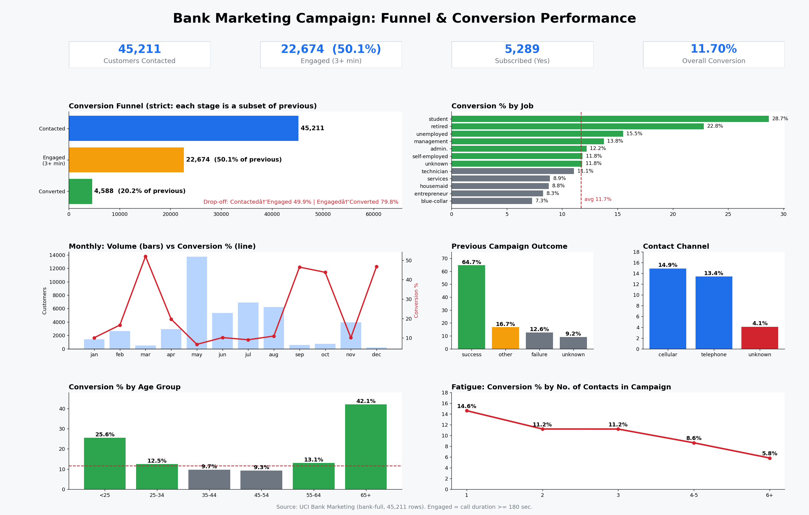

# Marketing Funnel & Conversion Performance Analysis

**Future Interns | Data Science & Analytics | Task 3 (2026)**

## Overview
This project analyzes a bank's telemarketing campaign to understand how customers move through the funnel (contacted → engaged → converted), where they drop off, which segments convert best, and how to improve conversions.



## Dataset
- **Source:** UCI Bank Marketing dataset (`bank-full.csv`)
- **Size:** 45,211 customers, 17 columns
- **Target:** `y` (did the customer subscribe to a term deposit: yes/no)
- **Data quality:** no missing values, no duplicate rows

## Tools
Python (pandas, matplotlib), Jupyter Notebook, VS Code, Power BI

## Approach
1. Loaded and validated the data (separator `;`, nulls, duplicates).
2. Engineered features: `converted`, `engaged` (call of 3+ minutes), `age_group`, `balance_band`, `campaign_band`.
3. Built a strictly nested funnel where each stage is a subset of the previous one.
4. Compared conversion rates across job, month, contact type, age, balance, loans, previous campaign outcome and number of contacts.
5. Built a dashboard and exported clean CSVs for Power BI.

## Funnel
| Stage | Customers | % of previous stage | % of total |
|---|---|---|---|
| Contacted | 45,211 | - | 100% |
| Engaged (call >= 3 min) | 22,674 | 50.15% | 50.15% |
| Converted (engaged and subscribed) | 4,588 | 20.23% | 10.15% |

**Overall conversion** (all "yes" responses): 5,289 / 45,211 = **11.70%**.
Note: 701 customers subscribed after a call shorter than 3 minutes, which is why total subscriptions (5,289) are higher than the funnel's final stage (4,588).

## Key Insights
1. **Biggest drop-off:** 79.8% of engaged customers did not convert. About 18,000 people stayed on the call for 3+ minutes but still said no, so the pitch and offer are the largest improvement opportunity.
2. **Past success predicts future success:** customers who accepted a previous campaign convert at **64.7%**, versus 9.2% for customers with no history.
3. **Best segments:** students (28.7%) and retired customers (22.8%). Age 65+ converts at 42.1% and under-25s at 25.6%. Blue-collar workers convert the least (7.3%).
4. **Channel matters:** cellular converts at 14.9% and telephone at 13.4%, while customers with an unknown contact type convert at only 4.1% (13,020 customers).
5. **Seasonality:** March (52%), September (46%), October (44%) and December (47%) have very high conversion but very low volume (under 750 customers each). May had 13,766 contacts with only 6.7% conversion, meaning lots of effort for little return.
6. **Contact fatigue:** conversion falls from 14.6% on the first contact to 5.8% after 6 or more contacts.
7. **Financial profile:** customers with a housing loan convert at 7.7% (vs 16.7% without), and with a personal loan at 6.7% (vs 12.7% without).

## Recommendations
- Prioritize warm segments: previous-campaign successes, students, retired and 65+ customers.
- Cap contact attempts at 2-3 per customer to avoid fatigue and wasted calls.
- Test shifting call volume from May towards high-converting months (March, September, October, December).
- Prefer the cellular channel and fix data capture for "unknown" contact type.
- Create a follow-up flow (email or SMS offer) for the ~18,000 engaged customers who did not convert.
- Design separate messaging or products for customers with housing or personal loans.

## Limitations
- `duration` is only known after the call ends, so engagement is a post-call metric and cannot be used for pre-call targeting.
- The dataset contains only the month (no year or exact date), so time analysis is month-level.
- This is observational data. Differences between segments do not prove causation.
- 82% of customers have `poutcome = unknown` (no previous campaign history).

## Project Structure
```
├── data/bank-full.csv                  # Raw dataset
├── powerbi_ready/                      # Clean CSVs for Power BI
│   ├── bank_clean.csv
│   ├── funnel.csv
│   └── seg_*.csv                       # Segment-wise conversion tables
├── charts/dashboard.png                # Dashboard screenshot
├── bank_marketing_analysis.ipynb       # Full analysis notebook
├── analysis.py                         # Data cleaning and analysis script
└── dashboard.py                        # Dashboard generation script
```
